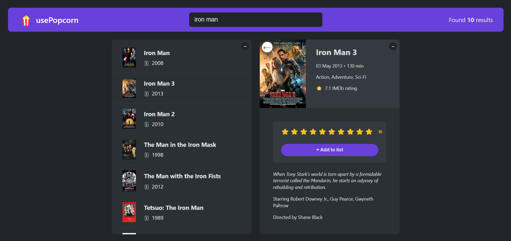

# Movie Rating App

A simple and focused project designed to explore the most commonly used React Hooks. This web app lets you rate movies you've watched and search for new ones, providing details about each film.

Grab some popcorn and find your next favorite movie!

## App Screenshot

### `npm start`

> Runs the app in the development mode. \
> Open [http://localhost:3000](http://localhost:3000) to view it in your browser.

The page will reload when you make changes.\
You may also see any lint errors in the console.

### Deployment

[Access the deployed Web App here!](https://google.com)
